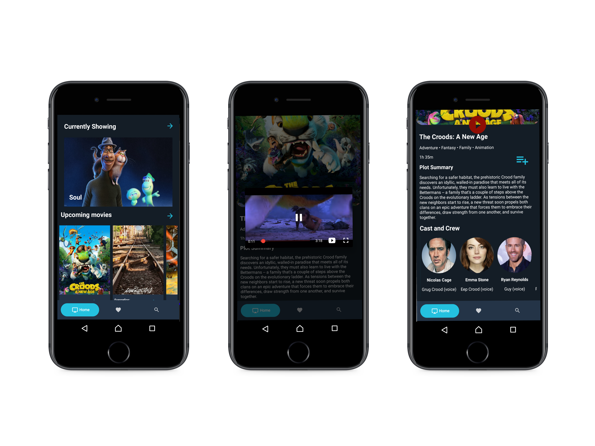

<h1 align="center">Movie Night</h1>
<h4 align="center">
	Discover the most popular and top rated movies playing. Movies data fetched using <a href="https://www.themoviedb.org/">themoviedb.org</a> API.
</h4>


## ✨ Screenshots
| Main Screen | Favorites |  Search |
|:-:|:-:|:-:|
|  |  |  |
| Movie Details | Trailers |  Actor |
|  |  |  |

## 🌟 Features
*   Discover the most popular and the most rated movies
*   User can view and play trailers on video dialogue
*   Shows a list of reviews for each movie
*   Users can mark a movie as favorite in the details view by tapping a plus icon 
*   Advanced uses of Room
*   Navigation Component
*   MVVM with Android Architecture Components(Room, LiveData, ViewModel)
*   Handle network status and network failures
*   ConstraintLayout(guidelines, barriers... etc)
*   Material design.

## 🚀 Getting Started
These instructions will get you a copy of the project up and running on your local machine for development and testing purposes.

### Prerequisites
*   Android Studio 3.2+
*   Java JDK

### Installing
Follow these steps if you want to get a local copy of the project on your machine.

#### 1. Clone or fork the repository by running the command below	
```
https://github.com/islamelhady/movie-night.git
```

#### 2. Import the project in AndroidStudio, and add API Key
1.  In Android Studio, go to File -> New -> Import project
2.  Follew the dialog wizard to choose the folder where you cloned the project and click on open.
3.  Android Studio imports the projects and builds it for you.
4.  Add TheMovieDb API Key inside `gradle.properties` file.

```
API_KEY="Your API Key here"
```

## 🤝 How to Contribute
1.  Fork it
2.  Create your feature branch (git checkout -b my-new-feature)
3.  Commit your changes (git commit -am 'Add some feature')
4.  Push to the branch (git push origin my-new-feature)
5.  Create new Pull Request

## 📃 Libraries used
*   [AndroidX](https://developer.android.com/jetpack/androidx/) - Previously known as 'Android support Library'
*   [Glide](https://github.com/bumptech/glide) - for loading and caching images 
*   [Retrofit 2](https://github.com/square/retrofit) - Type-safe HTTP client for Android and Java by Square, Inc. 
*   [Gson](https://github.com/google/gson) - for serialization/deserialization Java Objects into JSON and back
*   [LiveData](https://developer.android.com/topic/libraries/architecture/livedata)
*   [ViewModel](https://developer.android.com/topic/libraries/architecture/viewmodel)
*   [DataBinding](https://developer.android.com/topic/libraries/data-binding/)
*   [OkHttp](https://github.com/square/okhttp)
*   [CircleImageView](https://github.com/hdodenhof/CircleImageView)
*   [TextDrawable](https://github.com/amulyakhare/TextDrawable)


## Authors

* **Islam Elhady** - *LinkedIn* - [Islam Elhady](https://www.linkedin.com/in/islamelhady)

```
MIT License

Copyright (c) 2020 Islam Elhady
```
